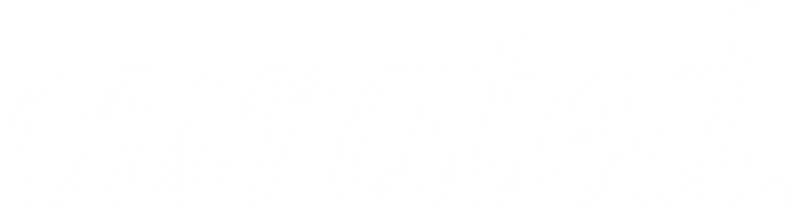
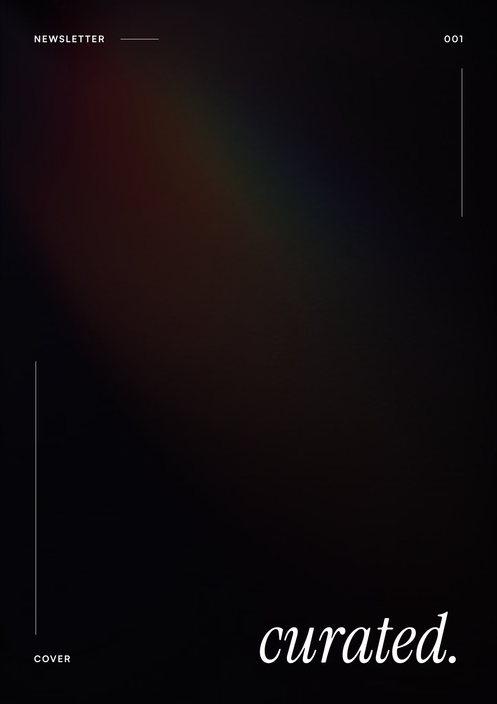

<div align="center">



---

**A newsletter of thoughtful research, deep dives, and curated insights.**

---

## What is curated.?

**curated.** is a research-driven newsletter featuring in-depth analysis and comprehensive research reports on topics that matter.

This repository contains all **curated.** content—research materials, drafts, and published issues.

## Repository Structure

```
CURATED/
├── assets/              # Brand assets and logos
├── December/            # Research materials and source files
├── published/           # Published issues and previews
└── README.md
```

## Published Issues

<table>
<tr>
<td width="50%" align="center">
<a href="./published/curated-001.pdf">

</a>

</td>
<td width="50%" align="center">
<p><strong>Issue #001</strong><br>
December 2025</p>
<p>Click the image to read.</p>
</td>
</tr>
<tr>
<td align="center"></td>
<td align="center">
<p><em>January 2026 — Coming soon</em></p>
</td>
</tr>
</table>
